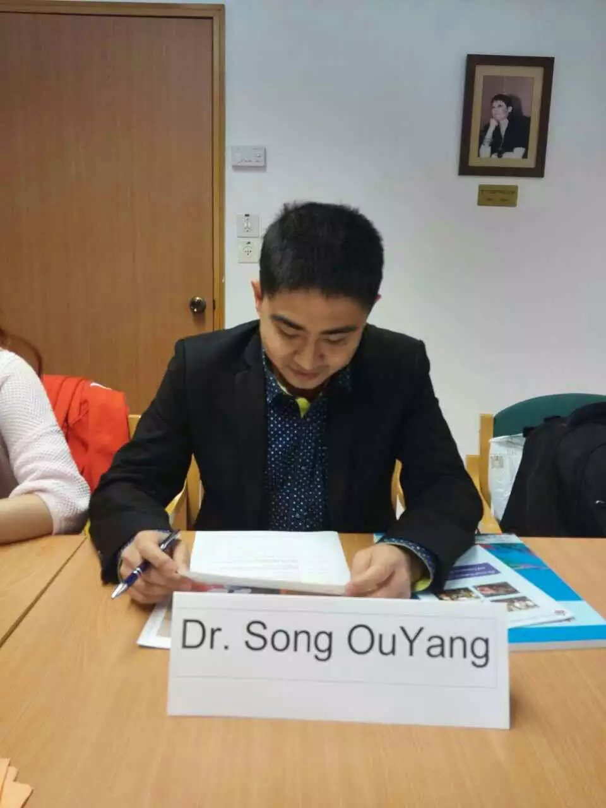

```{r, include=FALSE}
knitr::opts_chunk$set(
  results='asis', 
  echo = FALSE
)


CRANpkg <- function (pkg) {
    cran <- "https://CRAN.R-project.org/package"
    fmt <- "[%s](%s=%s)"
    sprintf(fmt, pkg, cran, pkg)
}

Biocpkg <- function (pkg) {
    sprintf("[%s](http://bioconductor.org/packages/%s)", pkg, pkg)
}

library(glue)
library(tidyverse)

# Set this to true to have links turned into footnotes at the end of the document
PDF_EXPORT <- FALSE

# Holds all the links that were inserted for placement at the end
links <- c()

find_link <- regex("
  \\[   # Grab opening square bracket
  .+?   # Find smallest internal text as possible
  \\]   # Closing square bracket
  \\(   # Opening parenthesis
  .+?   # Link text, again as small as possible
  \\)   # Closing parenthesis
  ",
  comments = TRUE)

sanitize_links <- function(text){
  if(PDF_EXPORT){
    str_extract_all(text, find_link) %>% 
      pluck(1) %>% 
      walk(function(link_from_text){
        title <- link_from_text %>% str_extract('\\[.+\\]') %>% str_remove_all('\\[|\\]') 
        link <- link_from_text %>% str_extract('\\(.+\\)') %>% str_remove_all('\\(|\\)')
        
        # add link to links array
        links <<- c(links, link)
        
        # Build replacement text
        new_text <- glue('{title}<sup>{length(links)}</sup>')
        
        # Replace text
        text <<- text %>% str_replace(fixed(link_from_text), new_text)
      })
  }
  
  text
}


# Takes a single row of dataframe corresponding to a position
# turns it into markdown, and prints the result to console.
build_position_from_df <- function(pos_df){
  
  missing_start <- pos_df$start == 'N/A'
  dates_same <- pos_df$end == pos_df$start
  if (pos_df$end == 9999) {
    pos_df$end = "present"
  }
  if(any(c(missing_start,dates_same))){
    timeline <- pos_df$end
  } else {
    timeline <- glue('{pos_df$end} - {pos_df$start}')
  }

  descriptions <- pos_df[str_detect(names(pos_df), 'description')] %>% 
    as.list() %>% 
    map_chr(sanitize_links)
  
  # Make sure we only keep filled in descriptions
  description_bullets <- paste('-', descriptions[descriptions != 'N/A'], collapse = '\n')
  
  if (length(description_bullets) == 1 && description_bullets == "- ") {
    description_bullets <- ""
  }
  glue(
"### {sanitize_links(pos_df$title)}

{pos_df$loc}

{pos_df$institution}

{timeline}

{description_bullets}


"
  ) %>% print()
}

# Takes nested position data and a given section id 
# and prints all the positions in that section to console
print_section <- function(position_data, section_id){
  x <- position_data %>% 
    filter(section == section_id) %>% 
    pull(data) 
  
  prese <- " - "
  xx <- list()

  for (i in seq_along(x)) {    
      y = x[[i]]
      y <- cbind(y, start2 = as.character(y$start))
      y <- cbind(y, end2 = as.character(y$end))

      se <- paste(y$start, "-", y$end, collapse = " ")
      if (prese == se) {
        y$start2 = ""
        y$end2 = ""
      } else {
        prese = se
      }

    xx[[i]] <- select(y, -c(start, end)) %>%
      rename(start=start2, end=end2)
  }
    
  xx %>% 
    purrr::walk(build_position_from_df)
}


fill_nas <- function(column){
  ifelse(is.na(column), 'N/A', column)
}

# Load csv with position info
position_data <- read_csv('positions.csv') %>% 
  mutate_all(fill_nas) %>% 
  arrange(order, desc(end)) %>% 
  mutate(id = 1:n()) %>% 
  nest(data = c(-id, -section))
```

```{r}
# When in export mode the little dots are unaligned, so fix that. 
if(PDF_EXPORT){
  cat("
  <style>
  :root{
    --decorator-outer-offset-left: -6.5px;
  }
  </style>")
}
```


Aside
================================================================================


{width=100%}

```{r}
# When in export mode the little dots are unaligned, so fix that. 
if(PDF_EXPORT){
  cat("View this CV online with links at _swcyo.github.io/cv_")
}
```

联系方式 {#contact}
--------------------------------------------------------------------------------


- <i class="fa fa-envelope"></i> swcyo@126.com
- <i class="fa fa-weibo"></i> swcyo
- <i class="fa fa-github"></i> github.com/swcyo
- <i class="fa fa-link"></i> swcyo.github.io
- <i class="fa fa-edit"></i> swcyo.haodf.com
- <i class="fa fa-qq"></i> 297481169
- <i class="fa fa-weixin"></i> swcyoyond
- <i class="fa fa-phone"></i> (+86) 18799743299


个人职称 {#skills}
--------------------------------------------------------------------------------

教学职称

 - 讲师(2019-)
 - 助教 (2013)

学历学位

 - 在读博士(2018-)
 - 硕士学位(2013)
 - 学士学位(2010)

临床职称

 - 主治医师(2015-)
 - 住院医师(2013-2015)

Disclaimer {#disclaimer}
--------------------------------------------------------------------------------


Last updated on `r Sys.Date()`.


Main
================================================================================

欧阳松 {#title}
--------------------------------------------------------------------------------


```{r, results='asis'}
intro_text <- glue("[石河子大学医学院第一附属医院](http://www.sdyfy.com.cn/)泌尿外科主治医师,[石河子大学](http://www.shzu.edu.cn/)讲师")

cat(sanitize_links(intro_text))
```

我的ORCID ID[https://orcid.org/0000-0001-7962-2811](https://orcid.org/0000-0001-7962-2811)

石河子大学医学院第一附属医院泌尿外科及生殖医学科主治医师，讲师，硕士研究生，华中科技大学同济医学院在读博士，擅长泌尿男性生殖系统常见疾病的诊疗，对男性生殖医学疾病具有较深研究，擅长各种男科手术及输尿管镜诊疗技术，熟练显微镜下精索静脉低位结扎术等显微技术。相继赴以色列西勒雅法医学中心及郑州大学第一附属医院主修男性辅助生殖及泌尿外科微创技术，获结业证书。在国内外泌尿专业权威杂志上发表论文10余篇，多次参加国内及疆内专业学术讲座。


教育经历 {data-icon=graduation-cap data-concise=true}
--------------------------------------------------------------------------------

```{r, results='asis', echo = FALSE}
print_section(position_data, 'education')
```


相关证书 {data-icon=book}
--------------------------------------------------------------------------------

```{r, results='asis', echo = FALSE}
print_section(position_data, 'certificate')
```


教学经历{data-icon=chalkboard-teacher}
--------------------------------------------------------------------------------


```{r}
print_section(position_data, 'teaching_positions')
```


科研项目  {data-icon=chart-line}
--------------------------------------------------------------------------------

```{r}
print_section(position_data, 'grant')
```


学术文章 {data-icon=book}
--------------------------------------------------------------------------------


```{r}
print_section(position_data, 'academic_articles')
```
